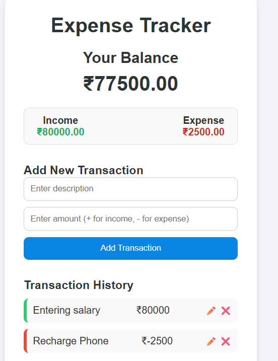

# 💰 Expense Tracker

## Description

A simple **Expense Tracker** built using **HTML, CSS, and JavaScript (ES Modules)** that allows users to manage their daily income and expenses. Users can **add, edit, and delete** transactions, view their **balance summary**, and store data locally using **localStorage** — all without a backend.

## Features

- Add new transactions (income or expense)  
- Edit existing transactions  
- Delete unwanted transactions  
- View total balance, income, and expense summaries  
- Persistent data storage using `localStorage`  
- Clean and responsive UI design  

## Concepts Practiced

- DOM manipulation  
- Working with arrays and objects  
- Event handling and form submission  
- Data persistence using `localStorage`  
- Conditional rendering and dynamic UI updates  
- Modular JavaScript (`index.mjs`)  

## Bonus Challenge

- Add a **dark mode toggle** in the navbar 🌙  
- Show a **monthly expense chart** using a JS chart library  
- Add a **filter/search** option for transactions  
- Allow users to **export data** as CSV  

## Live Demo

<iframe src="https://codesandbox.io/p/sandbox/f9n98v"
     style="width:100%; height: 500px; border:0; border-radius: 4px; overflow:hidden;"
     title="expense-tracker"
     allow="accelerometer; ambient-light-sensor; camera; encrypted-media; geolocation; gyroscope; hid; microphone; midi; payment; usb; vr; xr-spatial-tracking"
     sandbox="allow-forms allow-modals allow-popups allow-presentation allow-same-origin allow-scripts"
></iframe>

